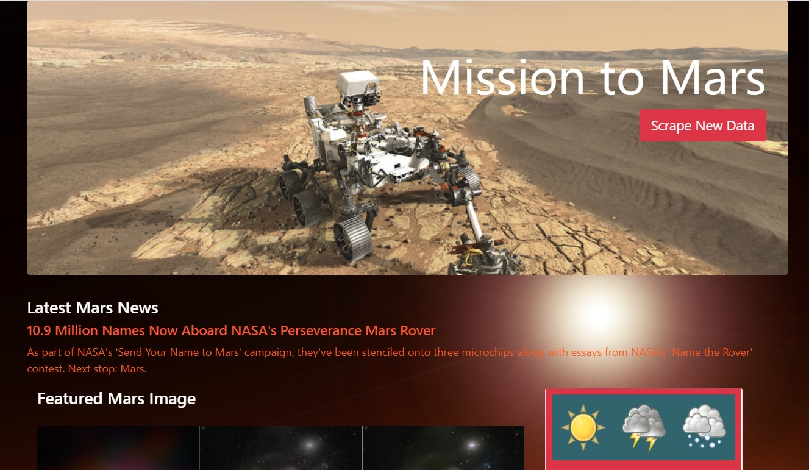

# Web Scraping Homework - Mission to Mars

A full-stack web scraping project to retrieve Mars-related data from various websites, store data in a MongoDB database and populate a web page. Data updates in real-time at the click of a button on the web page. Key tools: Python, Beautiful Soup, Splinter/Selenium, HTML/CSS/Bootstrap.

# Websites:

[NASA Mars News Site](https://mars.nasa.gov/news/)

[JPL Featured Space Image](https://www.jpl.nasa.gov/spaceimages/?search=&category=Mars)

[Mars Weather twitter](https://twitter.com/marswxreport?lang=en)

[Mars Facts](https://space-facts.com/mars/)

[USGS Astrogeology](https://astrogeology.usgs.gov/search/results?q=hemisphere+enhanced&k1=target&v1=Mars)

